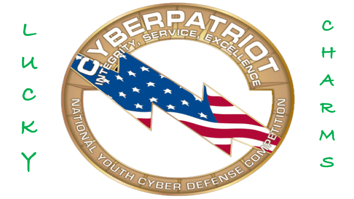

# Lucky Charms Cyberpatriot Knowledgebase

Some of the following materials used are from the [Cyberpatriots Training Materials Site](https://www.uscyberpatriot.org/competition/training-materials/training-modules).  All of the aforementioned source pdfs are in the /src/pdfs directory in this repository. All other information has NOT been vetted by the cyberpatriot program.

All artifacts in this repository are generated to help the Lucky Charms team in the cyberpatriot competition but I'll answer any questions which I can and are posed in the Q&A panel from the discussion tab.

The presentations directory hold the presentations and are segregated by area: cybersecurity, linux, windows.

All virtual machines were build using virtualbox and based on the [cyberpatriots practice images](https://www.uscyberpatriot.org/competition/training-materials/practice-images).

